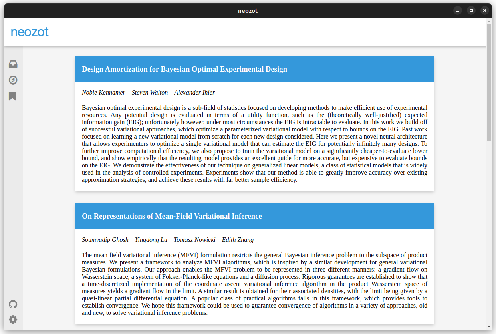

# neozot
neozot is a utility to get recommendations from arxiv based on your zotero library.



neozot will list the matching preprints from arxiv along with the closest match it
found in your zotero library and the score. By default, it lists 20 top suggestions.

## Usage
```
python -m neozot [-h] [-d DOMAINS [DOMAINS ...]] [-f] [-o OUTFILE] datadir

Super charge your research

positional arguments:
  datadir               Data directory of Zotero

optional arguments:
  -h, --help            show this help message and exit
  -d DOMAINS [DOMAINS ...], --domains DOMAINS [DOMAINS ...]
                        arxiv domain(s) to search in (Ex: cs.LG cs.CV cs.AI or high level as cs, math etc)
  -f, --force-refresh
  -o OUTFILE, --outfile OUTFILE
```

Example

1. If you zotero library is in `~/Zotero/` (directory where `zotero.sqlite` is stored) and you
want to get arxiv recommendations from `cs` domain, then use
```bash
python -m neozot ~/Zotero/ -d cs
```
2. If you only want results from `cs.AI` and `cs.LG`, use
```bash
python -m neozot ~/Zotero/ -d cs.AI cs.LG
```

## Requirements
1. [eel](https://pypi.org/project/Eel/) (>= 0.14.0)
2. [scikit-learn](https://pypi.org/project/scikit-learn/) (>= 1.0.1)
